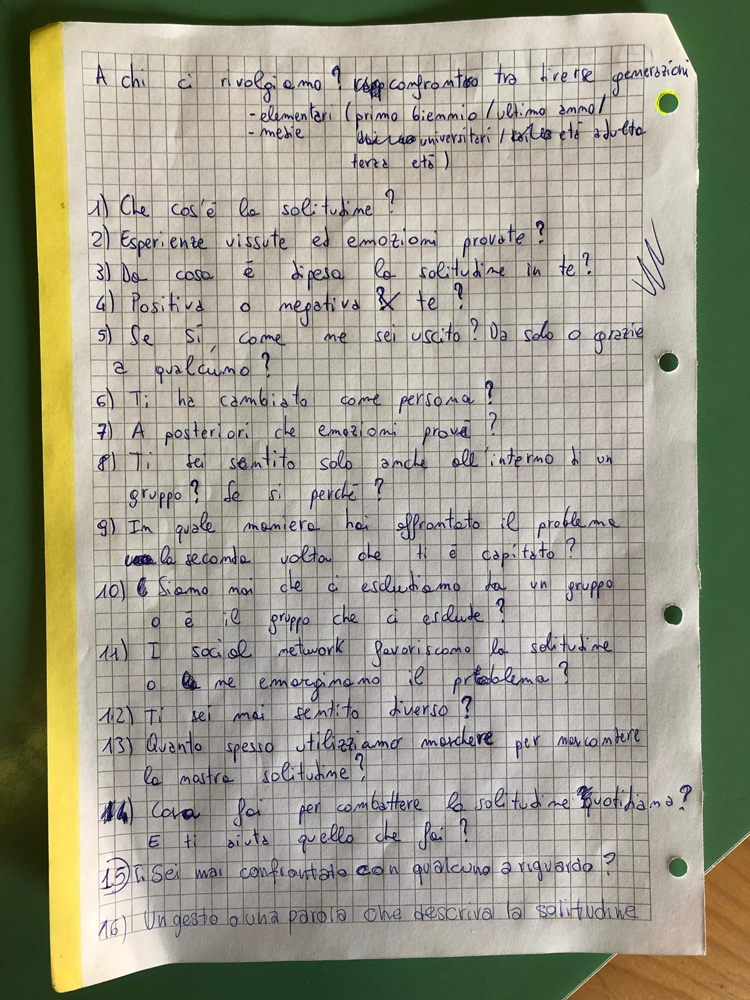
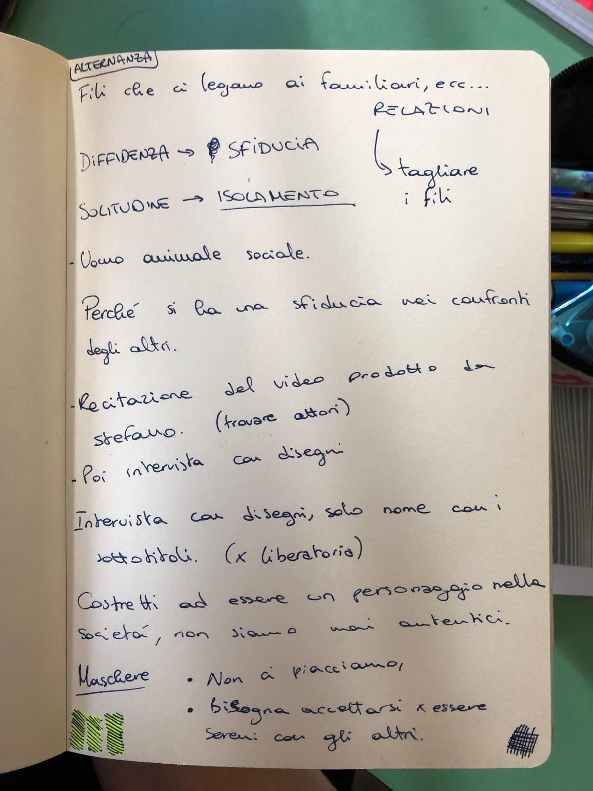
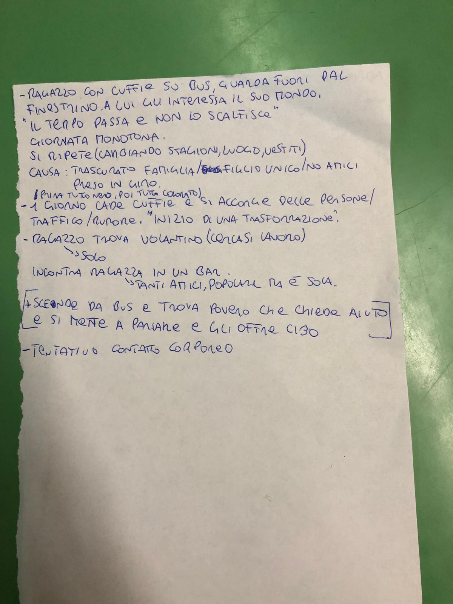

# Lavoro a Gruppi

| n. |      Gruppi      |               Persone              |
|:--:|:----------------:|:----------------------------------:|
|  1 | Raccolta domande | ...                                |
|  2 |    Interviste    | Savoca, Retta, Restagno, La Salvia |
|  3 |   Sceneggiatura  | Retta, Pulice, ...                 |
|  4 |  Arte/Solitudine | Riva, ...                          |

## Raccolta domande
1. Che cos'è la solitudine?
2. Esperienze vissute ed emozioni provate?
3. Da cosa è dipesa la solitudine in te?
4. Positiva o negativa per te?
5. Se si, come ne sei uscito? Da solo o grazie a qualcuno?
6. Ti ha cambiato come persona?
7. A posteriori che emozioni provi?
8. Ti sei sentito solo anche all'interno di un gruppo? Se si perchè?
9. In quale maniera hai affrontato il problema la seconda volta che ti è capitato?
10. Siamo mai che ci escludiamo da un gruppo o è il gruppo che ci esclude?
11. I social favoriscono la solitudine o ne emarginano il problema?
12. Ti sei mai sentito diverso?
13. Quanto spesso utilizzi maschere per nascondere la solitudine?
14. Cosa fai per combattere la solitudine quotidiana? E ti aiuta quello che fai?
15. Ti sei mai confidato con qualcuno a riguardo?
16. Un gesto o una parola che descriva la solitudine.

## Sceneggiatura
- Differenza -> sfiducia
- Solitudine -> isolamento
- Uomo animale sociale necessita di relazioni
- Recitazione del video prodotto da Stefano (trovare attori)
- Intervista con disegni, solo nome con i sottotitoli (questione liberatoria)
- Costretti ad essere un personaggio nella società, non siamo mai autentici
- Maschere
  - Non ci piacciono
  - Bisogna accettersi per essere sereni con glia altri

## Arte/Solitudine
- Ragazzo con cuffie sul bus guarda fuori dal finestrino immerso nel suo mondo
- Il tempo passa ma non se ne interessa
- Giornata monotona
- Il tutto si ripete (cambiando luoghi, vestiti, tempo, ...) (causa: famiglia/preso in giro/no amici/...)
- Un giorno gli cadono le cuffie e si accorge delle persone/traffico/rumore attorno a lui (Inizia cambiamento)
- Trova volantino cercasi lavoro
- Incontra una ragazza popolare in un bar (popolare solo in apparenza)
- Scende dal bus e trova un povero bisognoso di aiuto e si mette a parlare con lui offrendogli del cibo
- Tentativo contatto corporeo [con la ragazza spero...]

# Video
- Interviste come aggancio al presente.

