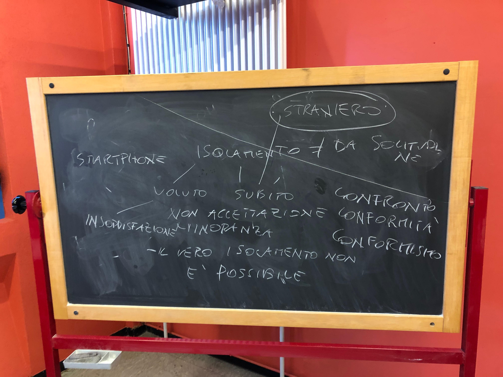

# Biennale democrazia (2019)

> NOTA: Ci sono sicuramente delle imperfezioni. Fatemi sapere se volete qualcosa cambiato o espresso in maniera più precisa e chiara :)

## Idee/Risorse

##### Gioda
- Incontrare compagnia giovani dello spettacolo teatrale era connesione virtuale.

##### Mariottini
> [manca]

#### Retta
- Solitudine di persone consapevoli di morire a breve.

#### Hanafi
- video <a href="https://youtu.be/iJUM11goXAU">Connection</a>.
- Isolamento legato all'incomprensione.

#### Soitu
> [manca]

#### Brusco
- Isolamento per inferiorità.

#### La Salvia
- Isolamento per confronto conflittuale (conformismo)(es. usare il cell per non rimanere isolato).

#### Savoca
- Prendere spunto da testi solitudine, citazioni libri/testi (fortemente coeso/no appello)
- Isolamento voluto per senso di insoddisfazione:
	- <b>Intenzionale</b>: es. anziani che ignorano amici/parenti/...
	- <b>Involontario</b>
- <b>Pedine</b>: giocare in base alle regole altrui per vincere (non è una scelta). 

#### Pulice
- Uomo persona sociale: impossibile isolamento totale (porta pazzia. es. isolamento carcerati).
- Social nascondono la condizione reale delle persone.
- Dimostrare qualcosa ottiene l'effetto opposto (volontariamente o non).

#### Prof. Salati
- Rinforzo/Contrasto a confronto.
- Differenza isolamento-solitudine.
	- Solitudine dimensione interiore (es. per asceti, monaci la solitudine non è negativa).
	- Mondo interiore vuoto

- 2 tipi isolamento:
	- Voluto: 
	- Subito:
		- Non accettazione.

- Uomo necessita relazioni.
- Film <a href="https://it.wikipedia.org/wiki/Qualcuno_vol%C3%B2_sul_nido_del_cuculo">Qualcuno Volò sul nido del cuculo</a>.
- Empatia mancante causa abuso social.
- Identificarsi nei difetti (freak, mostro) per fama (suicidio psicologico).

> Raccordo video obeso con progetto [Cercare video].

- Essere straniero (lingua, ideali, comportamenti, ...)

## Video

- Spiegazione visiva (No testo. Max 3-4 titoli).

## Compiti per venerdì 18
1. Partire dai propri sentimenti/esigenze per domandare della solitudine agli altri.
2. Incapacità di entrare in relazione con il corpo (corpo nostro e altrui come oggetto nello spazio). Quali parti del corpo sono più soggette all'isolamento e alla solitudine? Mancanza di sensazioni legate al corpo quando comunichiamo sui social.
3. Creare domande (inviare anche sul gruppo di filosofia).
