## PDFs
- <a href="https://github.com/IISPrimoLeviTorino/Biennale-Democrazia-5ASA/blob/master/Risorse%20Arte/Pieghevole_Sette_Palazzi_Celesti_Anselm_Kiefer_ITA.pdf">Pieghevole_Sette_Palazzi_Celesti_Anselm_Kiefer_ITA</a>
- <a href="https://github.com/IISPrimoLeviTorino/Biennale-Democrazia-5ASA/blob/master/Risorse%20Arte/PROVA_COP_DEf_.pdf">PROVA_COP_DEf_</a>

## Immagini

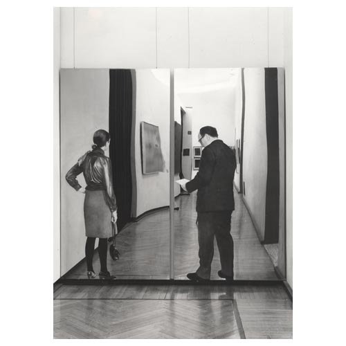
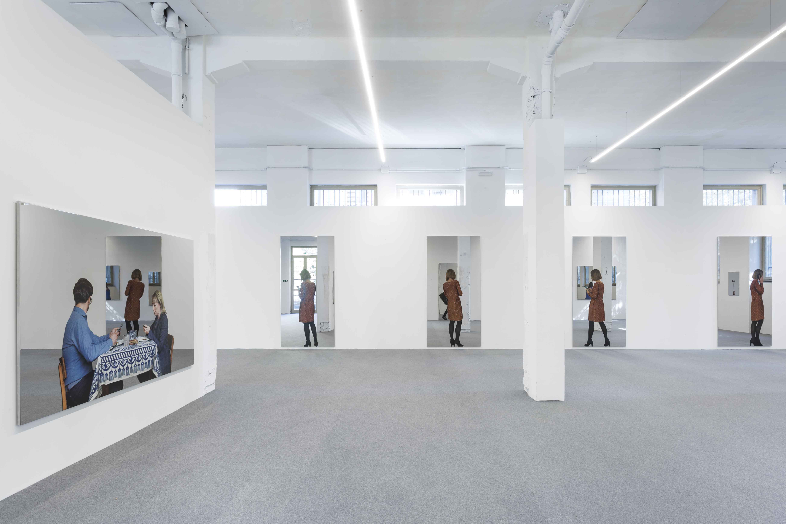
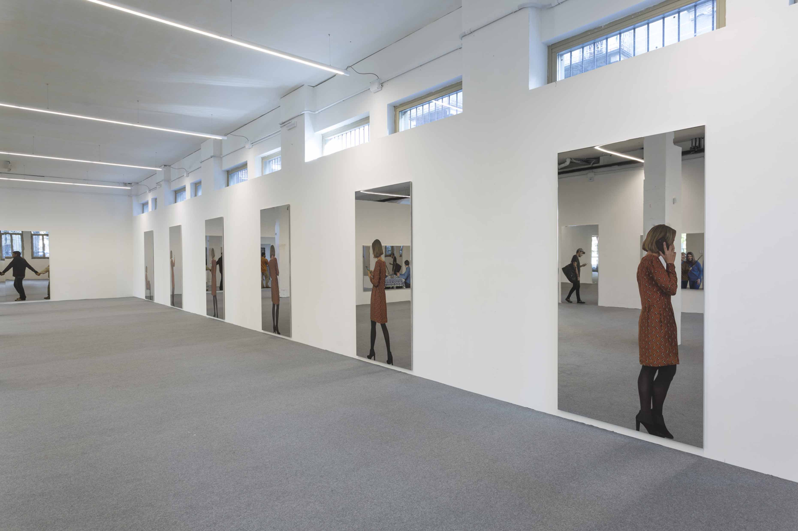
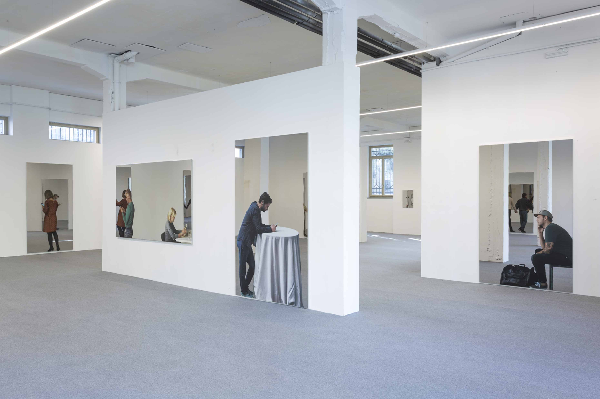
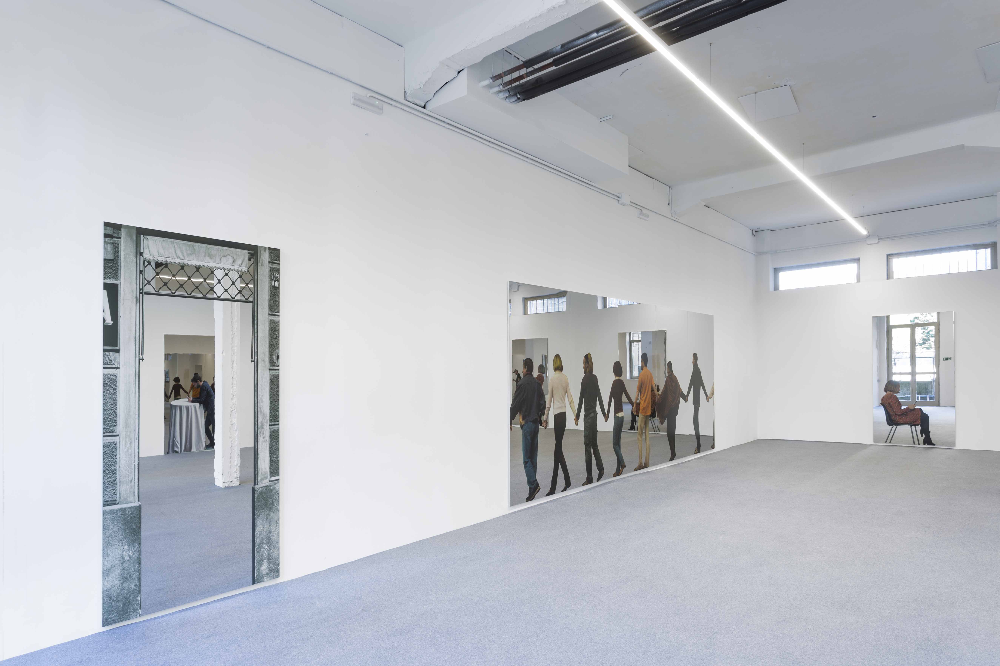
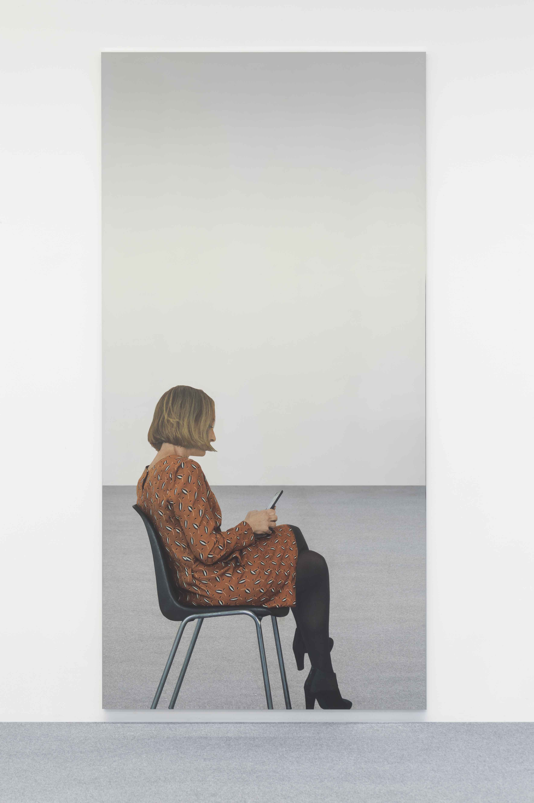
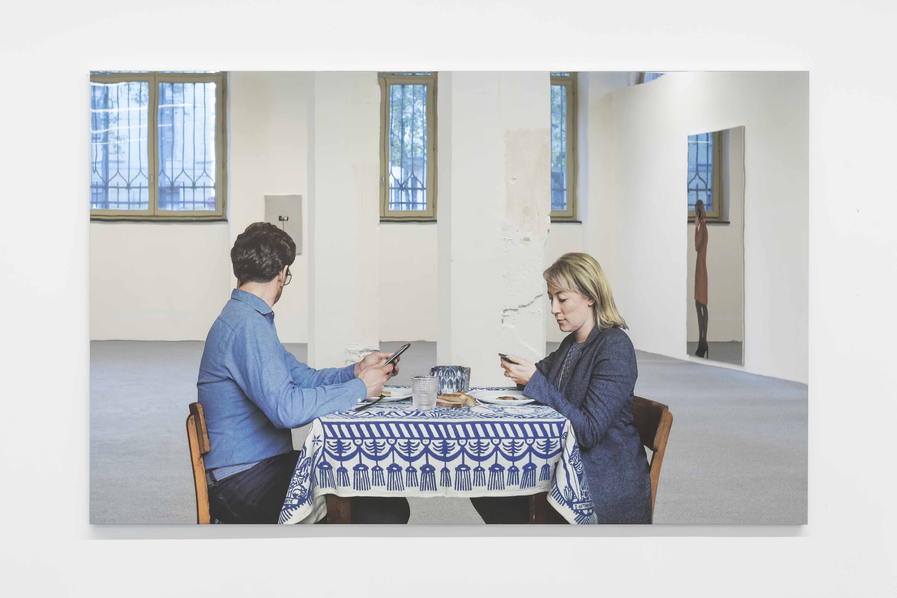
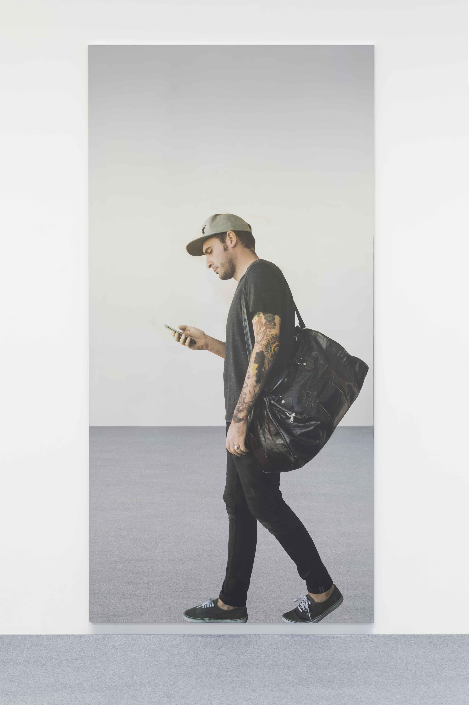
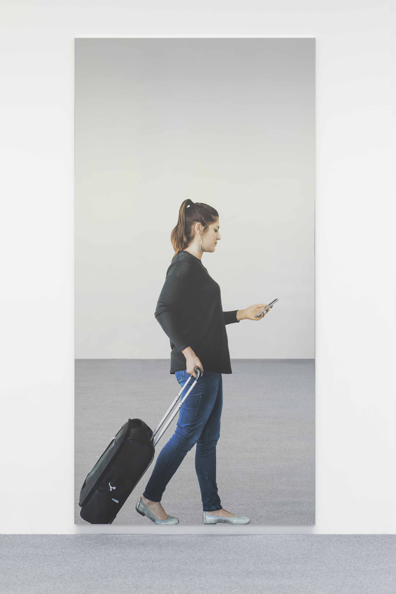
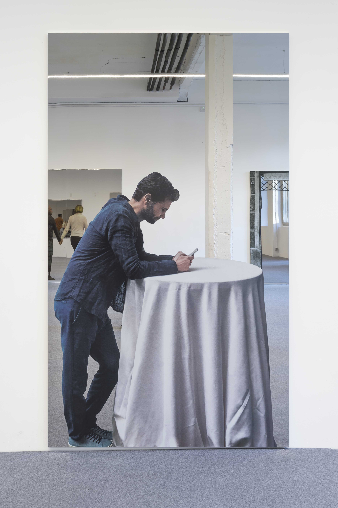
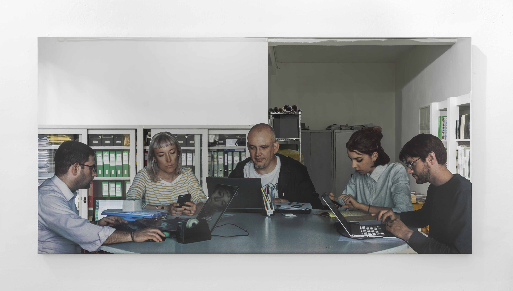
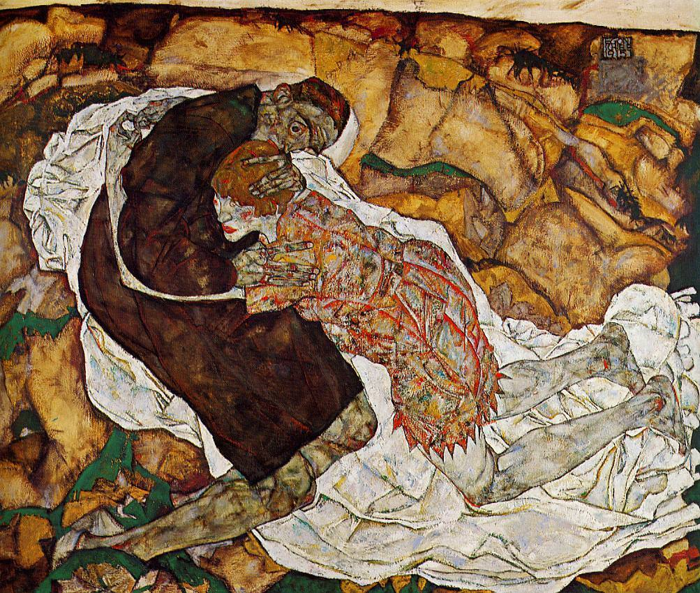
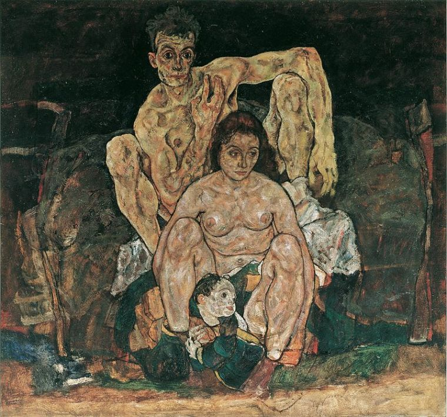
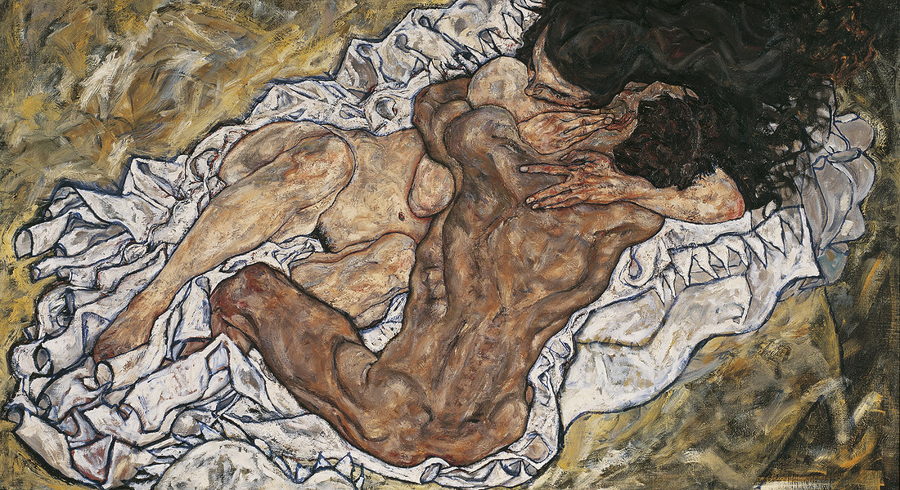
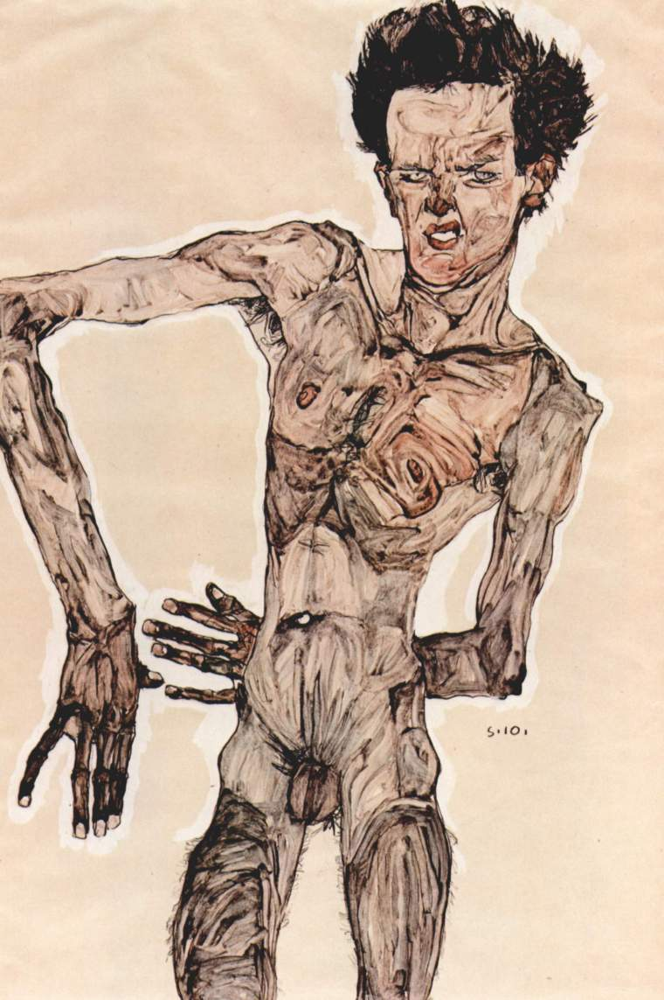

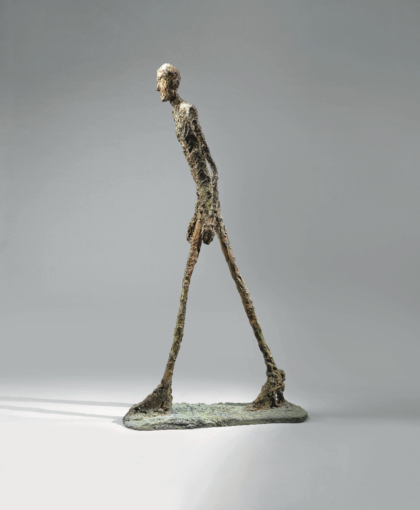
